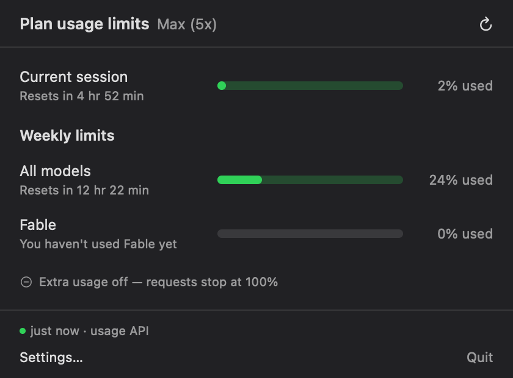
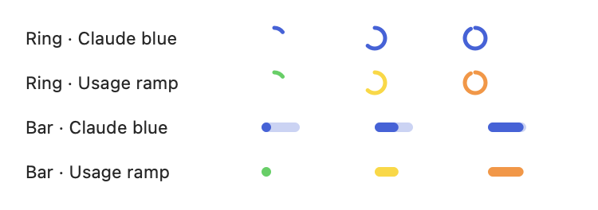

# claude-quota

Claude usage in the macOS menu bar. Checking it doesn't cost quota.

**On Windows?** See [`windows/`](windows/) for the notification-area port.




## Install

Requires macOS 13+, the Xcode command line tools (`xcode-select --install`),
and a Claude Pro or Max account.

```bash
./install.sh
```

That builds the app, installs it to `/Applications`, launches it, and offers to
set up the status line bridge. Re-run it any time to update. To remove
everything it did, `./install.sh --uninstall`.

Then send one message in Claude Code. `rate_limits` only appears after the
first API response of a session, so there's nothing to show before that.

If you already have a status line it keeps working. The installer moves your
command into `CLAUDE_QUOTA_CHAIN` and the bridge passes stdin through to it,
then prints its output. Undo with `statusline/install.py --apply --remove`.

## How it gets the numbers

Claude Code hands its status line command a JSON blob containing `rate_limits`,
with no network call. A bridge script caches that to disk and the app watches
the file.

Once the cache is more than two minutes old, the app falls back to
`GET /api/oauth/usage`, the endpoint `/usage` uses. That costs no quota, but it
is a network call, so it only runs to cover the gaps.

## Settings



| | |
|---|---|
| Indicator | Ring or Bar |
| Colours | Claude blue, or a usage ramp (green to red) |
| Menu bar shows | Session, weekly, or whichever is highest |
| Check every | 1 / 5 / 10 / 30 min, when the cache is stale |
| Usage API | Whether to use the OAuth fallback at all |
| Launch at login | Registers with `SMAppService` |

Claude blue matches Claude's own usage screen but stays the same colour at any
level. The usage ramp gives that up for a fill that shows how full you are. The
menu bar indicator and the popover both follow whichever you pick.
