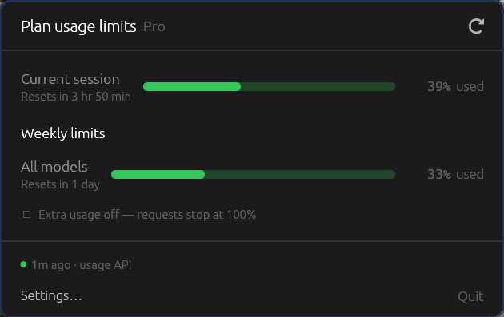
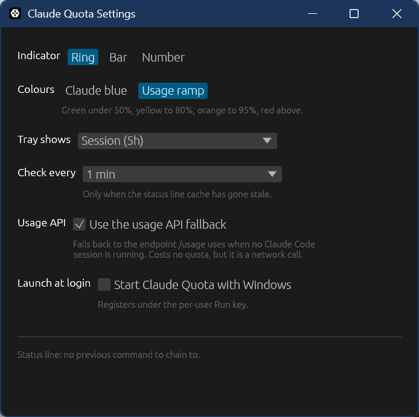
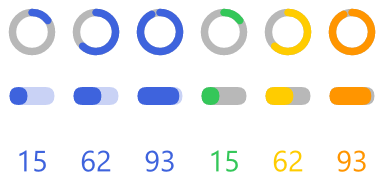

# claude-quota for Windows

Claude usage in the Windows notification area. Checking it doesn't cost quota.




A port of the [macOS menu bar app](../README.md) in `menubar/`. Same two data
sources, same numbers, same popover; a tray icon instead of a menu bar item.

## Install

Requires Windows 10 or 11, [Rust](https://rustup.rs), and a Claude Pro or Max
account.

```powershell
.\install.ps1
```

That builds `claude-quota.exe`, installs it to `%LOCALAPPDATA%\ClaudeQuota`,
adds a Start Menu shortcut, wires up the status line bridge, and launches it.
Re-run it any time to update. To remove everything it did:

```powershell
.\install.ps1 -Uninstall
```

Then send one message in Claude Code. `rate_limits` only appears after the
first API response of a session, so there's nothing to show before that.

**Windows 11 hides new tray icons.** The first time, click the `^` chevron at
the left of the notification area and drag Claude Quota onto the taskbar to keep
it there.

The exe is unsigned, so SmartScreen will warn on first run — More info → Run
anyway.

## How it gets the numbers

Identical to macOS, because it reads the same file.

Claude Code hands its status line command a JSON blob containing `rate_limits`,
with no network call. `claude-quota.exe statusline` caches that to
`~/.claude/quota-bar-cache.json` and the app watches the file.

Once the cache is more than two minutes old, the app falls back to
`GET /api/oauth/usage`, the endpoint `/usage` uses. That costs no quota, but it
is a network call, so it only runs to cover the gaps.

Your login is read from `~/.claude/.credentials.json`, where Claude Code stores
it on Windows — the same blob macOS keeps in the Keychain. It is read and never
written: refreshing the token ourselves would rotate it out from under Claude
Code and could sign you out of it.

## Settings



| | |
|---|---|
| Indicator | Ring, Bar, or Number |
| Colours | Claude blue, or a usage ramp (green to red) |
| Tray shows | Session, weekly, or whichever is highest |
| Check every | 1 / 5 / 10 / 30 min, when the cache is stale |
| Usage API | Whether to use the OAuth fallback at all |
| Launch at login | Registers under `HKCU\...\CurrentVersion\Run` |

Settings live in `%APPDATA%\ClaudeQuota\settings.json`.



Ring, bar and number, in Claude blue and then the usage ramp, at 15%, 62% and
93%. Drawn by the app rather than screenshotted — see `render_the_indicator_strip`
in `src/gauge.rs`.

**Number** has no macOS counterpart. A `MenuBarExtra` label can hold an image
*and* text, so the macOS app draws the ring and writes "23%" beside it. A tray
icon is a bare 16×16 bitmap with no label at all, so the percentage has to go
inside the icon or nowhere. Whichever indicator you pick, hovering the icon
shows every window and how fresh the reading is.

## What differs from the macOS app

Everything below is forced by the platform, not preference.

**The status line command cannot be quoted.** Claude Code on Windows runs
`statusLine.command` through Git Bash when Git Bash is installed, and through
PowerShell when it isn't. A single string has to work under both, and:

- `CLAUDE_QUOTA_CHAIN=<cmd> <script>`, the macOS installer's way of preserving
  an existing status line, is bash-only syntax and a parse error in PowerShell.
- A *quoted* executable path does not execute in PowerShell at all —
  `"C:/x/app.exe" arg` just prints the string. PowerShell wants
  `& "C:/x/app.exe"`, and Git Bash then tries to run a program called `&`.
- Backslashes are escapes in Git Bash, so a Windows-style path silently loses
  its separators.

What survives both is a bare, unquoted, forward-slash path — which only works if
it has no spaces. Hence the install location, and hence the chained command
moving into our own settings file instead of onto the command line. If your
profile path contains a space the installer falls back to the 8.3 short name,
and tells you rather than writing something broken if that is unavailable.

**Already have a status line?** It keeps working. The installer moves your
command into the `chain` key of `%APPDATA%\ClaudeQuota\settings.json`; the
bridge feeds it the untouched stdin through `cmd.exe` and prints its output.
`claude-quota.exe remove-statusline` puts it back.

**The Python bridge still works.** `statusline/claude-quota-statusline.py` from
the macOS tree writes the identical cache file, and the app reads it either way.
The exe subcommand is the default only because it removes the question of
whether `python` is on PATH in whichever shell Claude Code picked.

**One window, two shapes.** macOS gets the popover from `MenuBarExtra` for
free. Here it is an ordinary window that is undecorated and always-on-top by the
tray for the popover, and decorated and centred for settings. It is deliberately
not two windows: egui only builds a child viewport while the parent is painting,
and a hidden window is never asked to paint, so Settings opened from a closed
popover would open nothing at all.

**Taking focus is not automatic.** Windows only lets the process that owns the
most recent input event call `SetForegroundWindow`. A tray click is delivered to
us, but the input event belongs to the shell, so the popover comes up unfocused
and cannot dismiss itself on click-away. The fix is the documented one: borrow
the foreground thread's input queue for the duration of the call. If it fails
the popover still shows — Escape and a second tray click both close it.

## Development

```powershell
.\build.ps1 -Dev      # debug build
cargo test            # 110 tests, no network, no filesystem outside a temp dir
```

`build.ps1` builds to `%LOCALAPPDATA%\claude-quota-build` when the repository
lives inside OneDrive, Dropbox, or Google Drive. A Rust target directory is tens
of thousands of constantly-changing files and a couple of gigabytes; letting a
sync client chew on that is slow, fills the drive, and produces conflicts.

The tray app has no console, so there is nowhere for a diagnostic to go. Set
`CLAUDE_QUOTA_LOG` to a file path to get one:

```powershell
$env:CLAUDE_QUOTA_LOG = "$env:TEMP\claude-quota.log"
```

It records tray events, popover placement, and why the popover was dismissed.
It never records anything from the credential.

`claude-quota.exe` is a windows-subsystem binary, so that launching the tray app
never flashes a console. One consequence bites anything that scripts it: **the
shell does not wait for it.** `& claude-quota.exe install-statusline` returns the
moment the process launches, with an exit code of 0 whatever happens. Use
`Start-Process -Wait -NoNewWindow -PassThru` -- which is also what makes the
subcommand's output visible. `install.ps1` wraps that as `Invoke-Quota`.

Other environment variables, all shared with the macOS app:
`CLAUDE_QUOTA_CACHE` (cache file path), `CLAUDE_CONFIG_DIR` (`~/.claude`),
`CLAUDE_QUOTA_HOME` (our settings directory), `CLAUDE_QUOTA_CHAIN` (chained
status line command).

### Layout

| | |
|---|---|
| `src/snapshot.rs` | The usage windows. Port of `UsageSnapshot.swift` |
| `src/oauth.rs` | The usage endpoint client. Port of `OAuthUsageClient.swift` |
| `src/credentials.rs` | Reads `~/.claude/.credentials.json` |
| `src/status_line_cache.rs` | Reads and watches the cache file |
| `src/model.rs` | Refresh policy and backoff. Port of `UsageModel.swift` |
| `src/bridge.rs` | The `statusline` subcommand |
| `src/statusline_install.rs` | The `settings.json` wiring |
| `src/gauge.rs` | Tray icon rasterization and every colour in the app |
| `src/popover.rs` | The popover. Port of `MenuContentView.swift` |
| `src/settings_window.rs` | Settings. Port of `SettingsView.swift` |
| `src/tray.rs`, `src/app.rs` | Tray icon and event loop |
| `src/platform.rs` | The handful of Win32 calls the UI needs |
